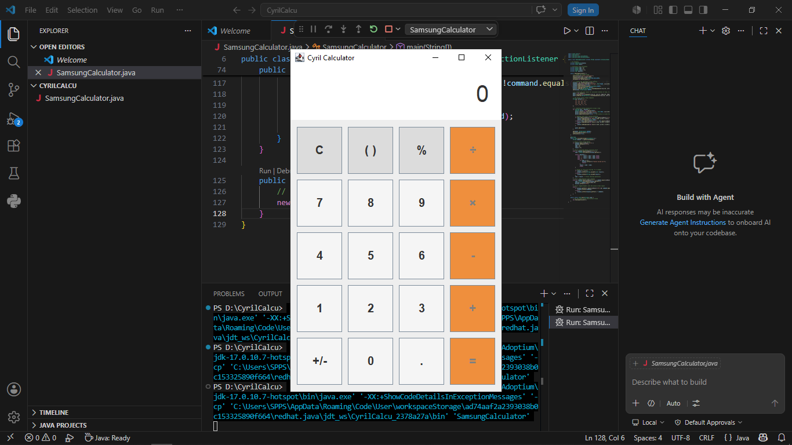

# samsung-java-calculator

A functional, user-friendly desktop application built from scratch using Java. The user interface mimics the layout, padding, and color schemes found on modern Samsung mobile calculator devices.

## 📸 Application Preview

## 🚀 Key Features
* **Grid Layout System:** Designed using a 5x4 `GridLayout` matrix to organize buttons proportionally.
* **State Operations Manager:** Implemented dynamic variable tracking to handle and chain arithmetic operations (+ , - , × , ÷).
* **Input Validation Constraints:** Coded condition handling to clear trailing zeroes for solid integers and display errors gracefully for math bugs like division by zero.

## 🛠️ Tech Stack
* **Language:** Java 17
* **GUI Engine:** Java Swing & AWT
* **IDE:** Visual Studio Code
